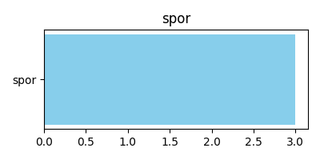
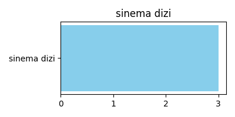
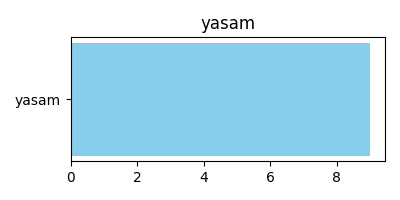
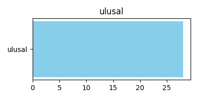
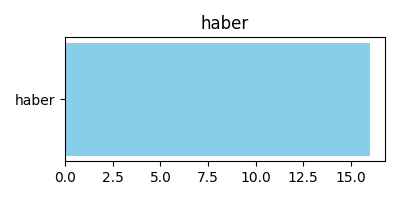
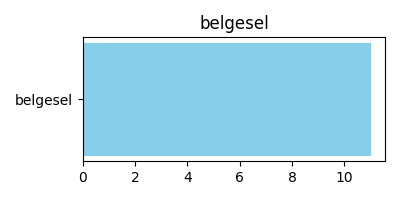
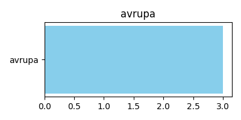

# 📺 IPTV Türk Playlist

🔗 **Playlist (LATEST)**  
https://cdn.jsdelivr.net/gh/k33n26/iptvturk@latest/playlist.m3u

<!-- STATS-START -->
- **Toplam Kanal:** **135** | **Sürüm:** `v1.0.6` | **Commit:** `405ba26` | **Güncelleme:** `2026-01-25 18:09:54 (TR)`

### spor
| Kanal | Ülke | Tür | Logo |
|------|------|-----|------|
| SPORTS TV |  |  |  |
| TJK TV |  |  |  |
| FB TV HD |  |  |  |

### sinema dizi
| Kanal | Ülke | Tür | Logo |
|------|------|-----|------|
| GRAND SINEMA |  |  |  |
| DENIZPOSTASI TV |  |  |  |
| Tivi 6 |  |  |  |

### yerel
| Kanal | Ülke | Tür | Logo |
|------|------|-----|------|
| AS TV |  |  |  |
| CAY TV |  |  |  |
| GRT |  |  |  |
| GTV |  |  |  |
| DIM TV |  |  |  |
| HABER61 TV |  |  |  |
| HUNAT TV |  |  |  |
| ICEL TV |  |  |  |
| KANAL 3 |  |  |  |
| KANAL 12 |  |  |  |
| KANAL 15 |  |  |  |
| KANAL 23 |  |  |  |
| KANAL 26 |  |  |  |
| KANAL 32 |  |  |  |
| KANAL 33 |  |  |  |
| KANAL 58 |  |  |  |
| KANAL FIRAT |  |  |  |
| KANAL V |  |  |  |
| KANAL Z |  |  |  |
| KARDELEN TV |  |  |  |
| KAY TV |  |  |  |
| KENTTURK TV |  |  |  |
| KONYA OLAY TV |  |  |  |
| LIFE TV |  |  |  |
| LINE TV |  |  |  |
| MKTV |  |  |  |
| MERCAN TV |  |  |  |
| MTURK TV |  |  |  |
| OLAYTURK TV KAYSERI |  |  |  |
| ON 6 TV |  |  |  |
| ON 4 TV |  |  |  |
| SUN RTV |  |  |  |
| CAN TEMPO TV |  |  |  |
| TON TV |  |  |  |
| TRABZON BBTV |  |  |  |
| TH TURK HABER |  |  |  |
| TV 1 KAYSERI |  |  |  |
| TV 41 |  |  |  |
| TV DEN |  |  |  |
| URFANATIK TV |  |  |  |
| ETV KAYSERI |  |  |  |
| ES TV |  |  |  |
| ERZURUM WEB TV |  |  |  |
| ER TV |  |  |  |
| CAN TV |  |  |  |
| BRTV |  |  |  |
| ANADOLU NET TV |  |  |  |
| ALTAS TV |  |  |  |
| ALANYA POSTA TV |  |  |  |
| AKSU TV |  |  |  |

### yasam
| Kanal | Ülke | Tür | Logo |
|------|------|-----|------|
| FORTUNA TV |  |  |  |
| DIYANET TV |  |  |  |
| DOST TV |  |  |  |
| LALEGUL TV |  |  |  |
| MELTEM TV |  |  |  |
| SEMERKAND TV |  |  |  |
| UU TV |  |  |  |
| VAV TV |  |  |  |
| DIYAR TV |  |  |  |

### muzik
| Kanal | Ülke | Tür | Logo |
|------|------|-----|------|
| NUMBER 1 TV |  |  |  |
| NUMBER 1 ASK |  |  |  |
| NUMBER 1 DAMAR |  |  |  |
| NUMBER 1 DANCE |  |  |  |
| POWER TV |  |  |  |
| POWER DANCE |  |  |  |
| POWER LOVE |  |  |  |
| POWER TURK |  |  |  |
| POWER TURK AKUSTIK |  |  |  |
| POWER TURK SLOW |  |  |  |
| POWER TURK TAPTAZE |  |  |  |
| TRT MUZIK 2K |  |  |  |

### ulusal
| Kanal | Ülke | Tür | Logo |
|------|------|-----|------|
| TRT1 2K |  |  |  |
| TRT 1 FHD |  |  |  |
| TRT2 2K |  |  |  |
| TRT BELGESEL 2K |  |  |  |
| TRT TURK 2K |  |  |  |
| TRT HABER 2K |  |  |  |
| TRT AVAZ 2K |  |  |  |
| TRT KURDI 2K |  |  |  |
| TRT ARABI 2K |  |  |  |
| TRT COCUK 2K |  |  |  |
| TRT DIYANET COCUK 2K |  |  |  |
| TRT EBA HD |  |  |  |
| TRT MUZIK 2K |  |  |  |
| TRT WORLD FHD |  |  |  |
| STAR |  |  |  |
| SHOW TV |  |  |  |
| NOW |  |  |  |
| KANAL D |  |  |  |
| ATV |  |  |  |
| TV8 |  |  |  |
| TV-8-BUCUK |  |  |  |
| Tv2 |  |  |  |
| TLC |  |  |  |
| CNBC-E |  |  |  |
| BLOOMBERG-HT |  |  |  |
| KANAL 7 |  |  |  |
| 360 TV |  |  |  |
| AFROTURK TV |  |  |  |

### haber
| Kanal | Ülke | Tür | Logo |
|------|------|-----|------|
| CNN-TURK |  |  |  |
| NTV |  |  |  |
| HABERGLOBAL |  |  |  |
| HABERTURK |  |  |  |
| HALK TV |  |  |  |
| TELE 1 |  |  |  |
| TGRT HABER |  |  |  |
| 24 HABER |  |  |  |
| HABER GLOBAL |  |  |  |
| HALK TV |  |  |  |
| HABERTURK |  |  |  |
| BENGUTURK TV |  |  |  |
| TV100 |  |  |  |
| TVnet |  |  |  |
| TYT TURK |  |  |  |
| AKIT TV |  |  |  |

### belgesel
| Kanal | Ülke | Tür | Logo |
|------|------|-----|------|
| TRT BELGESEL 2K |  |  |  |
| NAT-GEO-CHANNEL |  |  |  |
| NAT-GEO-WILD |  |  |  |
| DMAX |  |  |  |
| TLC |  |  |  |
| CGTN DOCUMENTARY |  |  |  |
| GZT |  |  |  |
| CİFTCİ TV |  |  |  |
| Tarım-TV |  |  |  |
| YAZ-TV |  |  |  |
| TGRT-BELGESEL |  |  |  |

### avrupa
| Kanal | Ülke | Tür | Logo |
|------|------|-----|------|
| KANAL 7 AVRUPA |  |  |  |
| EURO-D |  |  |  |
| EURO-STAR |  |  |  |

<!-- STATS-END -->

## 📈 Kanal Dağılımı

